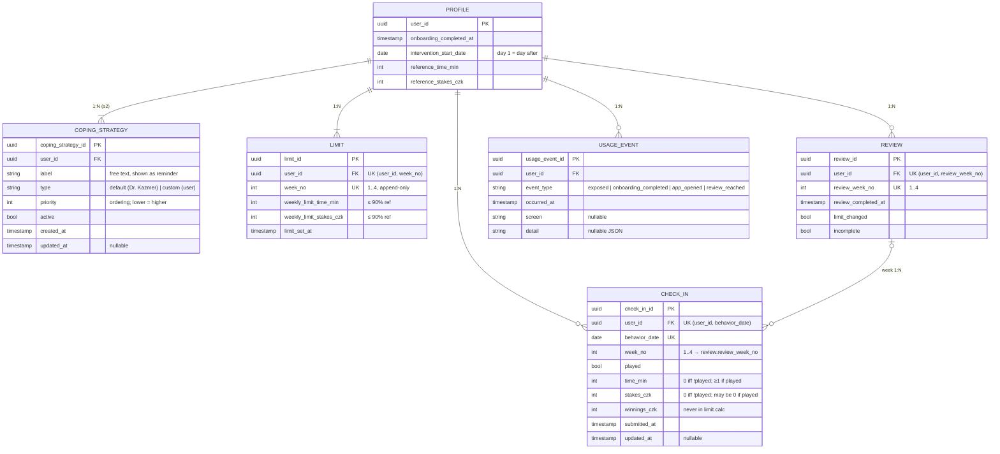

# Data Model

Single source of truth for the data layer. Diagrams: [`../../../docs/architecture.md`](../../../docs/architecture.md).
Field names verbatim from the brief — don't rename (export spec depends on them).

Stance: MVP on IndexedDB, one demo user `A001`; schema modelled server-ready
(normalized, `user_id` per user-owned row, integer money/time, UUID PKs).

## Entities

6 tables, cardinality relative to their parent:

- `profile` — root (1)
- `coping_strategy (1:N, ≥2)` — per user, ≥2 selected; `type` marks default (Dr. Kazmer) vs custom (user); exportable
- `limit (1:N)` — one per week, append-only
- `check_in (1:N)` — one per reported day; carries `week_no` linking it to its review week
- `review (1:N)` — one per closed week; groups its week's check-ins
- `usage_event (1:N)` — append-only interaction log (**required**)



Rendered copies (print): [`data-model.svg`](data-model.svg) · [`data-model.png`](data-model.png)

## Keys / constraints
- `check_in`: UNIQUE `(user_id, behavior_date)`
- `check_in.week_no` → `review.review_week_no` (per user) — links a day to its review week
- `limit`: UNIQUE `(user_id, week_no)`, append-only
- `review`: UNIQUE `(user_id, review_week_no)`
- `coping_strategy`: PK only (`type` distinguishes default vs custom)
- `usage_event`: no uniqueness (append-only)

Dexie `&[…]` compound index now → server `UNIQUE` later; same shape.

## Invariants
1. `!played` ⟹ `time_min = stakes_czk = winnings_czk = 0`
2. `played` ⟹ `time_min ≥ 1` (`stakes_czk`, `winnings_czk` may be 0)
3. ≤ 1 check-in per `(user_id, behavior_date)`
4. `weekly_limit_* ≤ 0.90 × reference_*`, every week
5. 1 `limit` per `(user_id, week_no)`; earlier rows never mutate
6. `winnings_czk` never enters a limit calc
7. no record ≠ a zero record (two distinct states)
8. ≥ 2 active `coping_strategy` per user (enforced at onboarding)

## Not stored — computed on read
Weekly used/totals, % vs limit, per-axis + overall status (worse of two),
remaining, `net_loss`, `is_backfill` (`date(submitted_at) > behavior_date + 1d`),
missing-day set + `has_missing`, `usage_event` aggregates.
(`check_in.week_no` is a stored classifier for the review join, not an aggregate.)

## usage_event — tracked events
| event_type | fires | feeds metric |
|---|---|---|
| `exposed` | first arrival to the app (once) | N exposed |
| `onboarding_completed` | user finishes onboarding (consent) | N consented |
| `app_opened` | every PWA open | N used > x times (count); N used > y weeks (span of `occurred_at`) |
| `review_reached` | reaches a review milestone; `detail.day ∈ {7,14,21,28}` | N "used" at pre-defined time points |

- Counts/spans are derived from rows + `occurred_at` — nothing aggregated is stored.
- "Use" of the intervention = ≥ 1 `app_opened`; milestone engagement = `review_reached`.
- `exposed` may instead be derived as a user's first `app_opened`.

## Dexie stores
```txt
profile:         "user_id"
coping_strategy: "coping_strategy_id, user_id, type, priority"
limits:          "limit_id, &[user_id+week_no], user_id, week_no, limit_set_at"
check_ins:       "check_in_id, &[user_id+behavior_date], user_id, behavior_date, week_no, submitted_at, updated_at"
reviews:         "review_id, &[user_id+review_week_no], user_id, review_week_no, review_completed_at"
usage_events:    "usage_event_id, [user_id+occurred_at], user_id, event_type"
```
`&[…]` = unique compound (enforces the invariants). Booleans (`active`,
`played`, `incomplete`) are NOT indexed — IndexedDB can't index booleans;
filter them in memory.

## Rules
- Money/time = integers; % is float, display-time only, never persisted.
- Value objects `Minutes` / `Czk`.
- Normalized stores; wrap multi-row writes (week-close review) in one transaction.
- Editing allowed only within `EDIT_WINDOW_DAYS` (X, float) of the day; the user
  always sees the deadline. Edits bump `updated_at`. Closed weeks: immutable.
- `coping_strategy`: one per-user table; `type` = `default` (Dr. Kazmer, seeded) or
  `custom` (user-written). ≥ 2 selected. Both editable/retireable and exportable.
- Export: person-day CSV (Příloha 2) **plus** the user's selected coping strategies.
- Schema version = Dexie `db.version(n)`; export envelope carries `schema_version`.
- Consistent time pickers across screens (UI concern, not data).

## Open
- `EDIT_WINDOW_DAYS` value (X) — TBD.
- Default coping content pending Dr. Kazmer (app not blocked — users add their own).
- Reference week editable after onboarding? Default no.
- Demo clock persistence: `app_meta` vs localStorage (`demo_day_offset` must survive refresh).
- Demo-drawer actions in `usage_event`: don't-log vs `origin` tag.

## Future extensions (README)
- Edit already-submitted results (fuller edit UX beyond in-window fill).
- Track retroactive edits: append-only `check_in_edit` log —
  `check_in_edit_id`, `user_id`, `check_in_id`, `action (created|updated)`,
  `edited_at`, `changed_fields`, `before`/`after` (JSON). Designed, not built.
